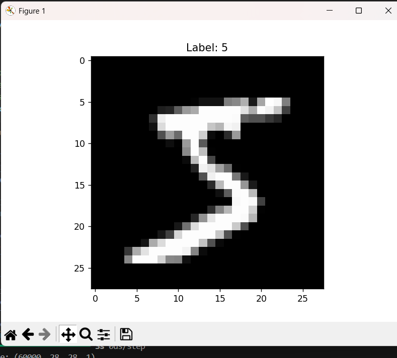
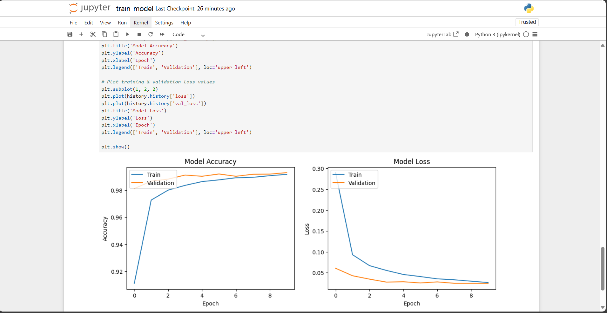
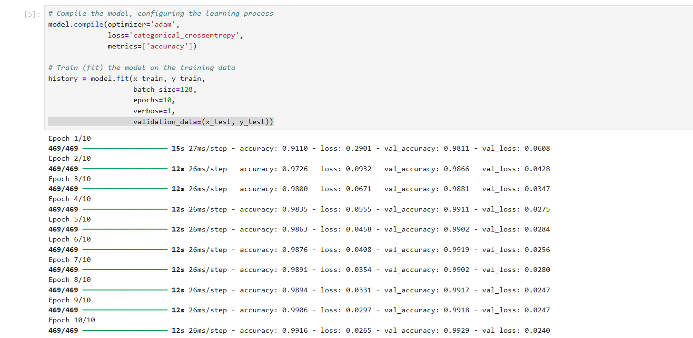
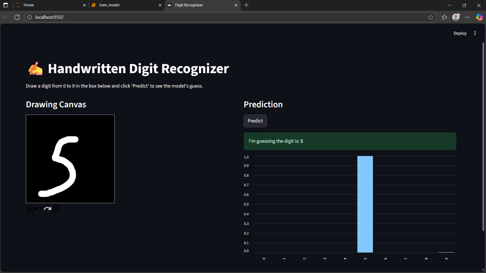
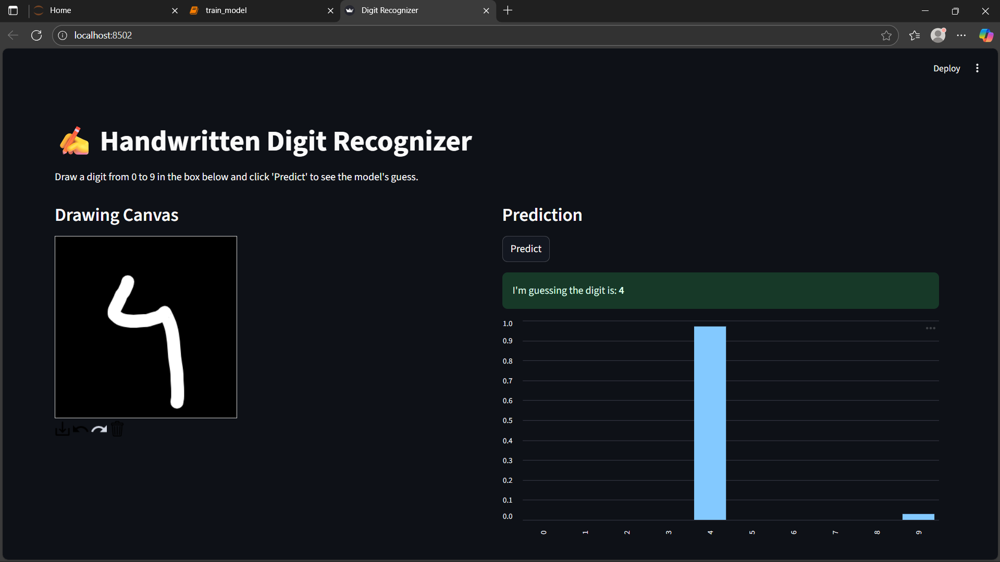
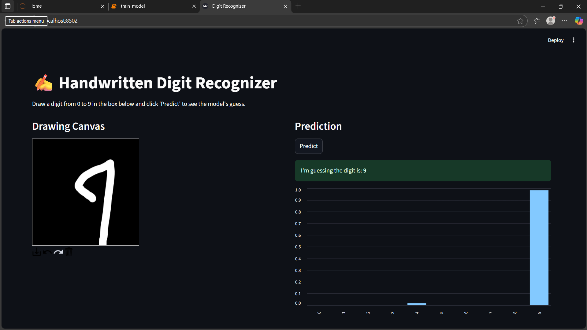

# ✍️ Handwritten Digit Recognizer

This project is an end-to-end handwritten digit recognizer built with a Convolutional Neural Network (CNN) using Python, TensorFlow, and Keras.

The model is trained on the classic MNIST dataset and uses data augmentation to improve its ability to generalize to real-world handwriting. The project culminates in an interactive web application built with Streamlit, allowing users to draw a digit and see the model's prediction in real-time.








---

## Features
- **CNN Architecture**: A simple but powerful CNN with two convolutional layers.
- **Data Augmentation**: Improves model robustness on handwriting styles not seen in the training set.
- **Interactive UI**: A real-time drawing canvas built with Streamlit and streamlit-drawable-canvas.
- **High Accuracy**: Achieves over 99% accuracy on the MNIST test set.

---

## Installation

To run this project locally, follow these steps:

1.  **Clone the repository:**
    ```bash
    git clone https://github.com/Krishnaa2327/handwritten-digit-recognizer.git
    cd handwritten-digit-recognizer
    ```

2.  **Create and activate a virtual environment:**
    ```bash
    # For Windows
    python -m venv venv
    .\venv\Scripts\activate

    # For macOS/Linux
    python3 -m venv venv
    source venv/bin/activate
    ```

3.  **Install the required dependencies:**
    ```bash
    pip install -r requirements.txt
    ```

---

## Usage

Once the installation is complete, you can launch the Streamlit application by running the following command in your terminal:

```bash
streamlit run app.py
````
A new tab should open in your web browser with the application running.
-----

## File Structure

```
.
├── app.py                      # The Streamlit web application script
├── mnist_digit_recognizer.h5   # The trained Keras model file
├── requirements.txt            # List of Python dependencies
└── README.md                   # This file
```
